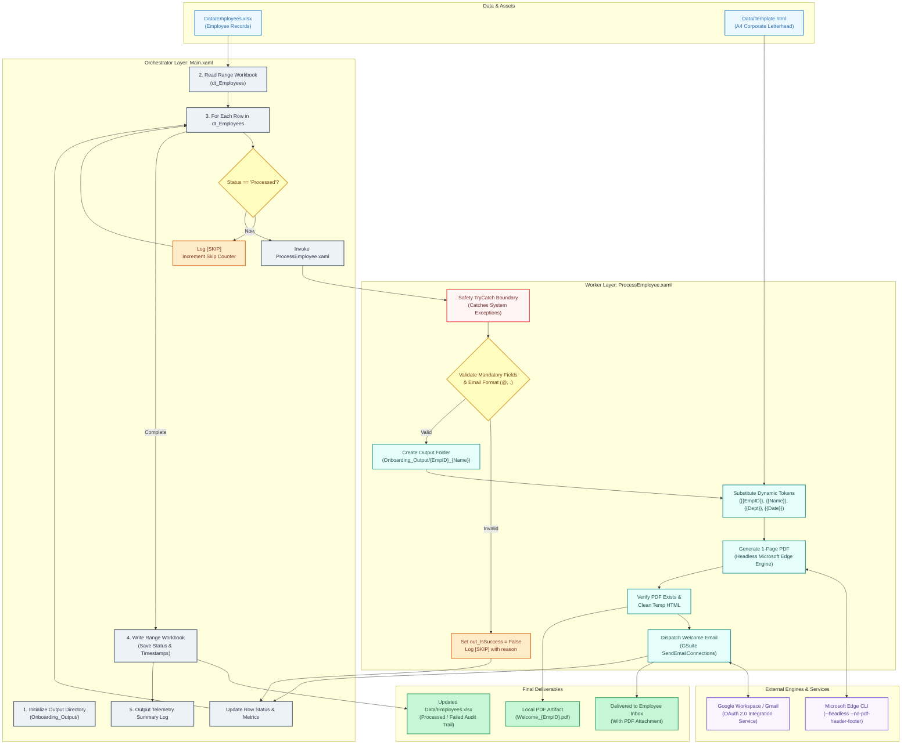

# Employee Onboarding Automation (RPA)

> **7th Semester Robotic Process Automation (RPA) Project**  
> **Platform:** UiPath Studio (Modern Windows Target Framework)  
> **Integrations:** Microsoft Excel, Google Workspace (Gmail API via OAuth 2.0), Headless Chromium (Edge/Chrome)

---

## 1. Project Abstract & Motivation

Employee onboarding in enterprise environments is often a repetitive, time-consuming, and error-prone administrative task. Human Resources personnel must manually verify candidate records from spreadsheets, compile personalized appointment letters, export documents to PDF, create directory folders, and send individual welcome emails with attachments.

This project delivers an **unattended, fault-tolerant RPA software robot** designed to fully automate the end-to-end onboarding pipeline:
- Ingests structured candidate data from an Excel workbook (`Data/Employees.xlsx`).
- Validates data integrity (mandatory fields and RFC-compliant email syntax).
- Creates an organized employee directory structure (`Onboarding_Output/{EmpID}_{Name}/`).
- Generates a branded, print-ready, **single-page A4 PDF** welcome letter dynamically using an HTML/CSS template—with zero dependency on Microsoft Word or Office Interop.
- Dispatches personalized welcome emails with the PDF attached directly via the **Google Workspace (Gmail) API**.
- Implements **closed-loop state tracking & idempotency**: stamps `Status` and timestamps back into the Excel spreadsheet, automatically skipping already-processed records on subsequent runs.

---

## 2. Key Architecture & Features

### A. Modular Orchestrator-Worker Architecture
Separates orchestration concerns (`Main.xaml`) from individual business processing (`ProcessEmployee.xaml`), following standard enterprise RPA design principles for modularity, maintainability, and fault isolation.

### B. Idempotency & Closed-Loop Write-Back
To prevent duplicate processing or duplicate email deliveries if execution is interrupted, the robot:
1. Checks the `Status` column in Excel. If `Status == "Processed"`, the row is skipped.
2. Updates `Status` (`Processed` or `Failed: <reason>`) and `ProcessedDate` in memory.
3. Automatically persists the updated DataTable back to `Data/Employees.xlsx` upon completion using `excel:WriteRange`.

### C. Zero-Dependency, 1-Page PDF Generation Engine
Rather than relying on resource-intensive Microsoft Office COM Interop libraries, the bot uses native headless Chromium (`msedge.exe` / `chrome.exe`) CLI printing with `--no-pdf-header-footer` and `@page { size: A4 portrait; margin: 10mm 15mm; }`. This produces a crisp, strictly single-page corporate PDF without headers, footers, or third-party license costs.

### D. Non-Halting Validation & Exception Handling
- **Business Rule Failures**: Malformed records (missing fields, invalid email format) are classified as business exceptions. They log a `[SKIP]` warning, update Excel with the failure reason, and gracefully continue to subsequent records without halting the robot.
- **System Exception Boundary**: The worker sequence is enclosed in an isolated `TryCatch` block to prevent file system or network faults from crashing the outer loop.

### E. Modern Google Workspace Integration
Uses `UiPath.GSuite.Activities` (`SendEmailConnections`) powered by OAuth 2.0 Integration Service, ensuring secure, token-based cloud delivery without hardcoded SMTP passwords or insecure app passwords.

---

## 3. System Architecture & Diagrams

### System Architecture Diagram




---

### Process Control Flowchart

```mermaid
flowchart TD
    Start([Start Automation]) --> EnsureDir["1. Ensure Output Directory Exists: Onboarding_Output/"]
    EnsureDir --> ReadExcel["2. Read Data/Employees.xlsx into dt_Employees"]
    ReadExcel --> LogStart["3. Log Process Start & Total Row Count"]
    LogStart --> ForEachRow{"For Each Row in dt_Employees"}

    ForEachRow -- Next Row --> ExtractData["Extract: EmpID, Name, Email, Dept, Status"]
    ExtractData --> CheckProcessed{"Status == 'Processed'?"}
    
    CheckProcessed -- Yes --> LogSkipAlready["Log [SKIP]: Already processed previously"]
    LogSkipAlready --> IncAlready["Increment alreadyProcessedCount"]
    IncAlready --> ForEachRow

    CheckProcessed -- No --> ResetVars["Reset isSuccess = False, errorMessage = ''"]
    ResetVars --> CallWorker["Invoke ProcessEmployee.xaml"]

    subgraph WorkerFlow["ProcessEmployee.xaml (Worker Workflow)"]
        Validate{"Mandatory Fields Present<br/>AND Email contains '@' and '.'?"}
        
        Validate -- No --> SetInvalid["Set out_IsSuccess = False<br/>out_ErrorMessage = Format Reason"]
        SetInvalid --> LogSkipReason["Log [SKIP] with reason"]

        Validate -- Yes --> MakeFolder["Create Directory: Onboarding_Output/{EmpID}_{Name}"]
        MakeFolder --> ReadTmpl["Read Data/Template.html"]
        ReadTmpl --> SubTokens["Replace {{EmpID}}, {{Name}}, {{Department}}, {{Date}}"]
        SubTokens --> WriteTemp["Write Populated temp_welcome.html"]
        WriteTemp --> RunEdge["Invoke Headless Edge Engine<br/>--headless --no-pdf-header-footer"]
        RunEdge --> VerifyPDF{"PDF Created Successfully?"}
        VerifyPDF -- Yes --> DelTemp["Delete temp_welcome.html"]
        VerifyPDF -- No --> ThrowFault["Catch / System Error"]
        DelTemp --> SendGSuite["uga:SendEmailConnections (GSuite)<br/>Send Welcome Email + Attach PDF"]
        SendGSuite --> SetValid["Set out_IsSuccess = True<br/>out_ErrorMessage = ''"]
        SetValid --> LogSuccess["Log [SUCCESS]: Onboarded & Email Sent"]
    end

    CallWorker --> WorkerFlow
    LogSkipReason --> CheckSuccess
    ThrowFault --> CheckSuccess
    LogSuccess --> CheckSuccess

    CheckSuccess{"isSuccess == True?"}
    CheckSuccess -- Yes --> MarkSuccess["CurrentRow('Status') = 'Processed'<br/>CurrentRow('ProcessedDate') = Now<br/>successCount++"]
    CheckSuccess -- No --> MarkFail["CurrentRow('Status') = 'Failed: ' + errorMessage<br/>CurrentRow('ProcessedDate') = Now<br/>failedCount++"]

    MarkSuccess --> ForEachRow
    MarkFail --> ForEachRow

    ForEachRow -- All Rows Processed --> WriteExcel["4. excel:WriteRange<br/>Write updated dt_Employees back to Employees.xlsx"]
    WriteExcel --> LogSummary["5. Log Summary Report:<br/>Total, Newly Processed, Skipped, Failed"]
    LogSummary --> End([End Automation])

    classDef startend fill:#2B6CB0,stroke:#2A4365,stroke-width:2px,color:#FFFFFF;
    classDef step fill:#EDF2F7,stroke:#4A5568,stroke-width:1.5px,color:#2D3748;
    classDef decision fill:#FEFCBF,stroke:#B7791F,stroke-width:2px,color:#744210;
    classDef success fill:#C6F6D5,stroke:#2F855A,stroke-width:2px,color:#22543D;
    classDef skip fill:#FEEBC8,stroke:#DD6B20,stroke-width:2px,color:#7B341E;
    classDef fail fill:#FED7D7,stroke:#C53030,stroke-width:2px,color:#742A2A;

    class Start,End startend;
    class EnsureDir,ReadExcel,LogStart,ExtractData,ResetVars,CallWorker,MakeFolder,ReadTmpl,SubTokens,WriteTemp,RunEdge,DelTemp,SendGSuite,WriteExcel,LogSummary step;
    class ForEachRow,CheckProcessed,Validate,VerifyPDF,CheckSuccess decision;
    class SetValid,LogSuccess,MarkSuccess success;
    class LogSkipAlready,IncAlready,LogSkipReason skip;
    class SetInvalid,ThrowFault,MarkFail fail;
```




---

## 4. Workflow Components & Arguments

### [`Main.xaml`](Main.xaml) (Orchestrator)
- **Role**: Master workflow that controls initialization, file I/O, looping, row state evaluation, and summary logging.
- **Variables**:
  - `dt_Employees`: System.Data.DataTable storing workbook records.
  - `templatePath`: Path to the HTML letter template (`Data\Template.html`).
  - `outputDir`: Directory for employee deliverables (`Onboarding_Output`).
  - `successCount`, `failedCount`, `alreadyProcessedCount`: Real-time telemetry counters.

### [`ProcessEmployee.xaml`](ProcessEmployee.xaml) (Worker)
- **Role**: Atomic workflow responsible for one employee's onboarding lifecycle.
- **Arguments**:

| Argument | Direction | Type | Description |
| :--- | :--- | :--- | :--- |
| `in_EmpID` | In | `String` | Employee identifier (e.g., `EMP001`) |
| `in_Name` | In | `String` | Candidate full name |
| `in_Email` | In | `String` | Candidate destination email address |
| `in_Department` | In | `String` | Assigned organizational department |
| `in_TemplatePath` | In | `String` | File path to `Template.html` |
| `in_OutputDir` | In | `String` | Base directory for output |
| `out_IsSuccess` | Out | `Boolean` | `True` if completely onboarded; `False` on skip/fail |
| `out_ErrorMessage`| Out | `String` | Validation or system error message |

---

## 5. Dataset Schema & Test Cases

The workbook [`Data/Employees.xlsx`](Data/Employees.xlsx) (Sheet: `Employees`) contains the following test suite designed to demonstrate positive runs and edge-case handling:

| EmpID | Name | Email | Department | Status (Initial) | Expected Result | Reason |
| :--- | :--- | :--- | :--- | :--- | :--- | :--- |
| `EMP001` | John Doe | `achintydummy@gmail.com` | Engineering | *(Empty)* | **SUCCESS** | Valid record; PDF created and email sent |
| `EMP002` | Jane Smith | `achintydummy@gmail.com` | Human Resources | *(Empty)* | **SUCCESS** | Valid record; PDF created and email sent |
| `EMP003` | Alex Kumar | `achintydummy@gmail.com` | Marketing | *(Empty)* | **SUCCESS** | Valid record; PDF created and email sent |
| `EMP004` | Bad Data | `invalid-email-address` | Finance | *(Empty)* | **SKIP** | Missing `@` or `.` in email address |
| `EMP005` | *(empty)* | *(empty)* | Operations | *(Empty)* | **SKIP** | Missing mandatory ID, Name, and Email |
| `EMP006` | Sarah Connor | `achintydummy@gmail.com` | Cybersecurity | *(Empty)* | **SUCCESS** | Valid record; proves loop continues after skips |
| `EMP007` | Achintya | `achintydummy@gmail.com` | AI Engineering | *(Empty)* | **SUCCESS** | Valid record; customized verification |

---

## 6. Prerequisites & Execution Guide

### Prerequisites
1. **UiPath Studio** (v2024.10+ / v2026.x Community or Enterprise).
2. **Runtime Dependencies** (auto-restored via `project.json`):
   - `UiPath.Excel.Activities` (`3.6.1+`)
   - `UiPath.GSuite.Activities` (`3.11.10+`)
   - `UiPath.Mail.Activities` (`2.11.10+`)
   - `UiPath.System.Activities` (`26.6.3+`)
3. **Browser**: Microsoft Edge or Google Chrome installed in default Program Files location.
4. **Google Account**: Connected via UiPath Integration Service (OAuth 2.0).

### Execution Steps
1. Open **UiPath Studio**.
2. Click **Open a Local Project** and navigate to `RPA_Project/project.json`.
3. Open `Main.xaml` in the Designer.
4. Press **`F5`** (Run File) or click **Run**.
5. Observe execution in the **Output Panel**:
   ```text
   [Information] Starting Employee Onboarding Automation Process...
   [Information] Reading employee records from Data\Employees.xlsx (Sheet: Employees)...
   [Information] Total employee records to process: 7
   [Information] Processing onboarding for: EMP001 - John Doe
   [Information] [SUCCESS] Successfully onboarded John Doe (EMP001) - Welcome PDF and email dispatched.
   ...
   [Warning]     [SKIP] EMP004: Invalid or missing email format ('invalid-email-address')
   [Warning]     [SKIP] UNKNOWN: Mandatory fields missing (EmpID/Name/Department)
   ...
   [Information] [SUCCESS] Successfully onboarded Sarah Connor (EMP006) - Welcome PDF and email dispatched.
   [Information] ONBOARDING COMPLETE | Total: 7 | Newly Processed: 5 | Previously Processed (Skipped): 0 | Failed/Invalid: 2
   ```
6. Verify output files in `Onboarding_Output/` and delivered emails in your Gmail inbox.

---

## 7. Viva & Academic Defense Cheatsheet

### Q1: Why did you adopt a two-file architecture (`Main.xaml` + `ProcessEmployee.xaml`) instead of a single workflow?
> **Answer:** It adheres to the **Single Responsibility Principle (SRP)** and enterprise RPA modularity. `Main.xaml` acts as the orchestrator handling data ingestion, iteration, state tracking, and write-back. `ProcessEmployee.xaml` acts as an atomic worker handling individual employee validation, rendering, and dispatch. This provides clean parameter decoupling and ensures that a fault in one employee's processing cannot corrupt the main loop.

### Q2: How did you implement PDF generation without requiring Microsoft Word or Adobe Acrobat?
> **Answer:** We leveraged native Chromium headless printing (`msedge.exe --headless --disable-gpu --run-all-compositor-stages-before-draw --no-pdf-header-footer --print-to-pdf=...`). This eliminates expensive Microsoft Office Interop licenses, prevents COM unmanaged memory leaks, and delivers consistent, single-page A4 PDF rendering with pure CSS styling.

### Q3: How does the automation ensure idempotency (preventing duplicate emails if re-executed)?
> **Answer:** Through **closed-loop Excel write-back**. The orchestrator checks if `CurrentRow("Status")` is `"Processed"`. If so, it increments the skipped counter and immediately advances to the next row. When a new row is processed, it updates `Status` and `ProcessedDate` in memory and executes `excel:WriteRange` at the end of the batch, maintaining a reliable audit trail.

### Q4: How are business exceptions handled differently from system exceptions?
> **Answer:** Business exceptions (e.g. malformed email or missing name) are handled proactively through an `If/Else` validation branch without raising unhandled `Throw` activities. This avoids interrupting the Studio debugger while cleanly logging `[SKIP]`. System exceptions (e.g., network outages or file-system locks) are caught by a surrounding `TryCatch` block, ensuring the robot records the error and proceeds safely to the next record.
